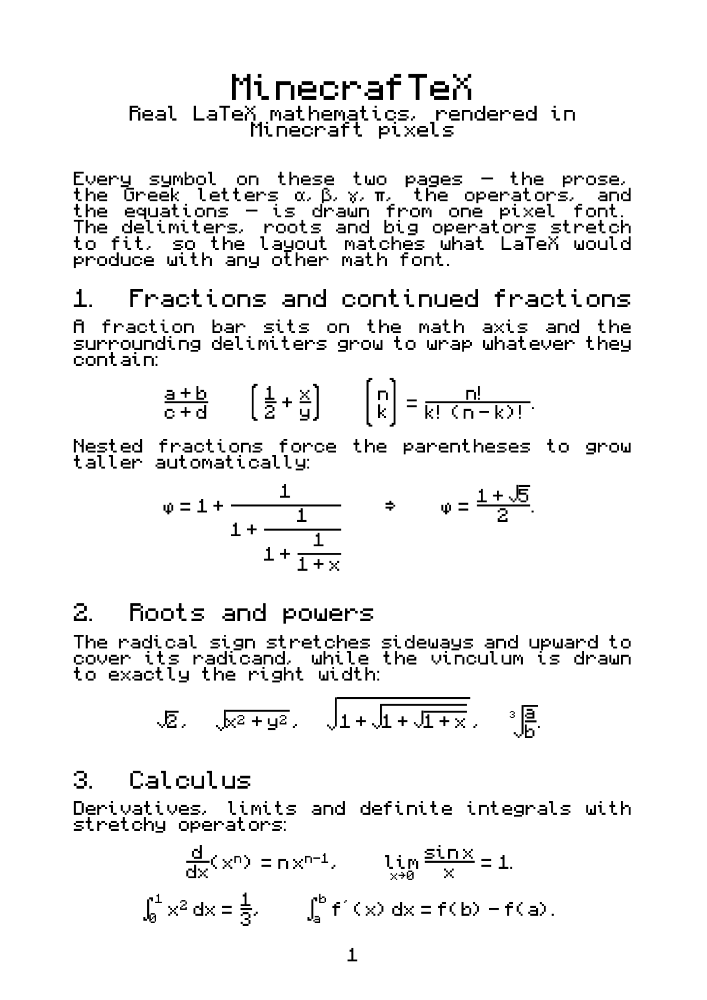
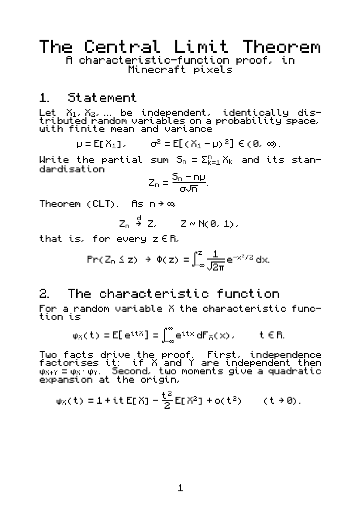

# MinecrafTeX

> **Real LaTeX math — rendered entirely in authentic Minecraft pixel art.**

[](LICENSE)
[](OFL.txt)
[](#use-it-in-latex)
[](#use-it-on-the-web)

MinecrafTeX lets you typeset ordinary mathematics — `\frac`, `\sqrt`, `\int`,
`\sum`, sub/superscripts, big delimiters, matrices … — using the **normal
LaTeX / AMS syntax you already know**, but every glyph and every structural rule
(fraction bars, radical vinculums, stretchy braces) is drawn as crisp,
blocky **Minecraft-style pixels**.

Everything that works in ordinary LaTeX math works here. Only the *look* changes.

<p align="center">
  
  
</p>

---

## Highlights

* 🧱 **Authentic pixel math** — built on [Monocraft](https://github.com/IdreesInc/Monocraft); even fraction bars and radicals are pixel-snapped.
* 🔁 **One font, two worlds** — the *same* OpenType MATH font drives both PDF (LuaLaTeX/XeLaTeX) and the browser (Temml → MathML).
* 📐 **Faithful adaptive sizing** — fraction bars, radicals and `\left…\right` delimiters grow with their content; big operators get a true display size — exactly like real TeX, because real TeX engines do the layout.
* 🔡 **Broad coverage** — full Monocraft glyph set, the Mathematical Alphanumeric Symbols block (so `\mathbb`, italic/bold math letters render as pixels), Greek, and the common relations/operators Monocraft itself lacks.
* 🆓 **Free & open** — MIT tooling, OFL 1.1 font. Download, use, ship.

## Why this works (the core idea)

We do **not** rewrite a math engine. We build **one OpenType font with a MATH
table** in a pixel style, then let proven, battle-tested engines do the layout:

| Layer | Tech | Role |
|-------|------|------|
| Font  | fontTools (pure Python) | pixel glyphs + OpenType **MATH** table |
| LaTeX | `fontspec` + `unicode-math` | loads the font as the math font |
| Web   | `Temml` + native MathML | the browser renders MathML with the font |

The MATH table is what teaches each engine how to size a fraction bar, stretch
an integral, grow braces and place scripts — so faithful math layout comes
"for free," just rendered in Minecraft pixels.

## Use it in LaTeX

Compile with a Unicode engine (**LuaLaTeX** or **XeLaTeX**):

```latex
\documentclass{article}
\usepackage[scale=2]{minecraftex}   % scale up to keep pixels crisp
\begin{document}
\[
  \int_{-\infty}^{\infty} \frac{1}{\sqrt{2\pi}}\, e^{-x^2/2}\,dx = 1
\]
\end{document}
```

```bash
lualatex yourfile.tex
```

Worked examples live in [`latex/`](latex/):

* [`latex/example.tex`](latex/example.tex) — a two-page math showcase.
* [`latex/clt.tex`](latex/clt.tex) — a short, PhD-level proof of the Central Limit Theorem.

## Use it on the web

MinecrafTeX ships a small web package that pairs [Temml](https://temml.org)
(LaTeX → MathML) with the pixel font:

```bash
cd web
npm install
npm run serve      # then open the demo in your browser
```

See [`web/demo/index.html`](web/demo/index.html) for a live LaTeX → pixel-MathML demo.

## Build the font yourself

```bash
pip install fonttools brotli
python font/build_font.py        # -> font/dist/MinecrafTeX-Math.ttf + .woff2
python tests/validate.py         # sanity-check + render sample PNGs
```

The whole grid is pixel-snapped: `UPM = 1000`, `1px = 100 units`, so every
edge, bar and gap lands on a whole-pixel boundary and stays sharp at any scale.

## Repository layout

```
font/      pixel-font build pipeline (Python + fontTools, no FontForge needed)
  src/       pixelfont.py, monocraft_loader.py, math_glyphs.py,
             math_alphanum.py, math_table.py, gsub.py
  build_font.py
  dist/      built MinecrafTeX-Math.ttf / .woff2
latex/     minecraftex.sty + example documents (example.tex, clt.tex)
web/       npm package + browser demo (Temml)
tests/     validation + rendered samples
```

## Status

The font core (pixel → OpenType + MATH table) builds, validates, round-trips
and renders. Two worked LaTeX documents render fully in pixels with adaptive
sizing. See [`ROADMAP.md`](ROADMAP.md) for what's next.

## Licensing

* **Font** (`font/`, `dist/*.ttf`, `*.woff2`): SIL Open Font License 1.1
  (`OFL.txt`). Derived from [Monocraft](https://github.com/IdreesInc/Monocraft)
  by Idrees Hassan, also OFL 1.1 — see [`NOTICE`](NOTICE).
* **Tooling and wrappers** (`font/src` build scripts, `latex/`, `web/`):
  MIT (`LICENSE`).

"Minecraft" is a trademark of Mojang / Microsoft; this project is unaffiliated
and uses no Minecraft game assets.

---

## Visitors

<p align="center">
  <em>Thanks for stopping by — every block counts! ⛏️</em>
</p>

<p align="center">
  
</p>

<p align="center">
  
</p>
