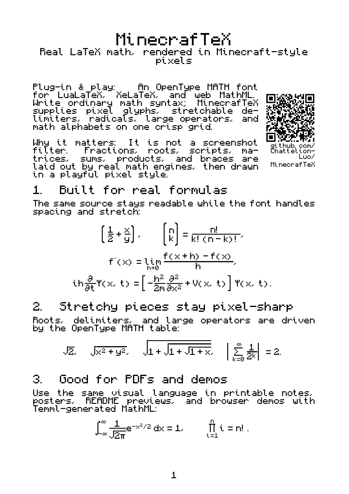
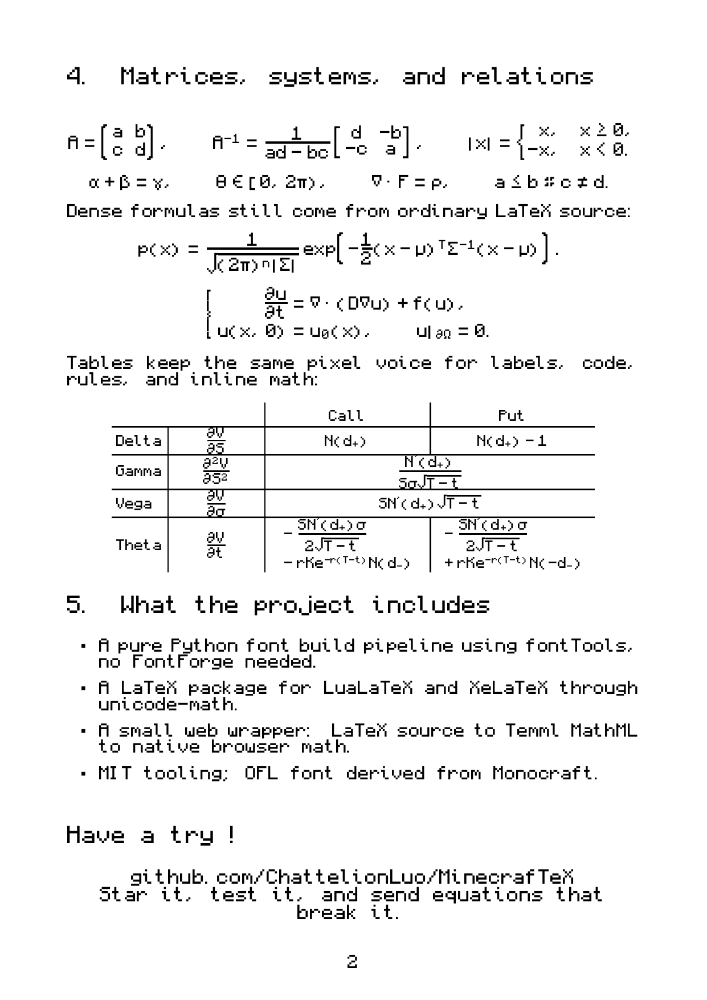

# MinecrafTeX

MinecrafTeX is an OpenType MATH font for writing real LaTeX-style mathematics
in a Minecraft-inspired pixel style.

[](LICENSE)
[](OFL.txt)
[](#use-it-in-latex)
[](#use-it-on-the-web)
[](https://hits.sh/github.com/ChattelionLuo/MinecrafTeX/)

It is not a fake equation renderer or a screenshot trick. You still write normal
math syntax such as `\frac`, `\sqrt`, `\int`, `\sum`, scripts, matrices, and
`\left...\right`; MinecrafTeX supplies the pixel font and the OpenType MATH data
that tell TeX or MathML how to stretch and place the pieces.

<p align="center">
  
  
</p>

---

## What works

* Built from [Monocraft](https://github.com/IdreesInc/Monocraft), with extra math glyphs drawn on the same pixel grid.
* One font works in PDFs and on the web: LuaLaTeX/XeLaTeX use `unicode-math`; browsers use MathML generated by Temml.
* Fractions, radicals, big operators, and stretchy delimiters are driven by the font's OpenType MATH table.
* Math alphabets such as `\mathbb`, bold, italic, script, fraktur, sans, and monospace are mapped back to pixel glyphs instead of falling through to Latin Modern.
* Common missing operators and relations are included: `≤ ≥ ≈ ∼ ∈ ∋ ∇ ⋅ ∪ ∅`, plus display variants for `∫`, `∑`, and `∏`.
* Standard Galactic Alphabet text is available with `\galactic{Hello World.}`.

## How it works

The project does not reimplement TeX. It builds one pixel font with a real MATH
table, then lets existing layout engines do their job:

| Layer | Tech | Role |
|-------|------|------|
| Font  | fontTools (pure Python) | pixel glyphs + OpenType **MATH** table |
| LaTeX | `fontspec` + `unicode-math` | loads the font as the math font |
| Web   | `Temml` + native MathML | the browser renders MathML with the font |

The MATH table contains the values and glyph assemblies that make fraction bars,
radicals, delimiters, scripts, and display operators behave like math instead of
plain text.

## Use it in LaTeX

Compile with a Unicode engine (**LuaLaTeX** or **XeLaTeX**):

```latex
\documentclass{article}
\usepackage[scale=2]{minecraftex}   % scale up to keep pixels crisp
\begin{document}
\[
  \int_{-\infty}^{\infty} \frac{1}{\sqrt{2\pi}}\, e^{-x^2/2}\,dx = 1
\]
\end{document}
```

```bash
lualatex yourfile.tex
```

Use `xelatex` instead if that is your preferred Unicode TeX engine. Plain
`pdflatex` cannot load this package because it depends on `fontspec` and
`unicode-math`.

Worked examples live in [`latex/`](latex/):

* [`latex/example.tex`](latex/example.tex) — a two-page math showcase.
* [`latex/clt.tex`](latex/clt.tex) — a short proof of the Central Limit Theorem.

## Use it on the web

MinecrafTeX ships a small web package that pairs [Temml](https://temml.org)
(LaTeX → MathML) with the pixel font:

```bash
cd web
npm install
npm run copy-font
npm run verify
npm run serve      # then open the demo in your browser
```

See [`web/demo/index.html`](web/demo/index.html) for a live LaTeX → pixel-MathML demo.

## Repository layout

```
font/      pixel-font build pipeline (Python + fontTools, no FontForge needed)
  src/       pixelfont.py, monocraft_loader.py, math_glyphs.py,
             math_alphanum.py, math_table.py, gsub.py
  build_font.py
  dist/      built TTF and WOFF2 fonts
latex/     minecraftex.sty + example documents (example.tex, clt.tex)
web/       npm package + browser demo (Temml)
tests/     validation + rendered samples
```

## Status

The font core (pixel → OpenType + MATH table) builds, validates, round-trips
and renders. Two worked LaTeX documents render fully in pixels with adaptive
sizing. See [`ROADMAP.md`](ROADMAP.md) for what's next.

## Licensing

* **Font** (`font/`, `dist/*.ttf`, `*.woff2`): SIL Open Font License 1.1
  (`OFL.txt`). Derived from [Monocraft](https://github.com/IdreesInc/Monocraft)
  by Idrees Hassan, also OFL 1.1 — see [`NOTICE`](NOTICE).
* **Tooling and wrappers** (`font/src` build scripts, `latex/`, `web/`):
  MIT (`LICENSE`).

"Minecraft" is a trademark of Mojang / Microsoft; this project is unaffiliated
and uses no Minecraft game assets.

---

## Visits

<p align="center">
  <a href="https://hits.sh/github.com/ChattelionLuo/MinecrafTeX/">
    
  </a>
</p>
